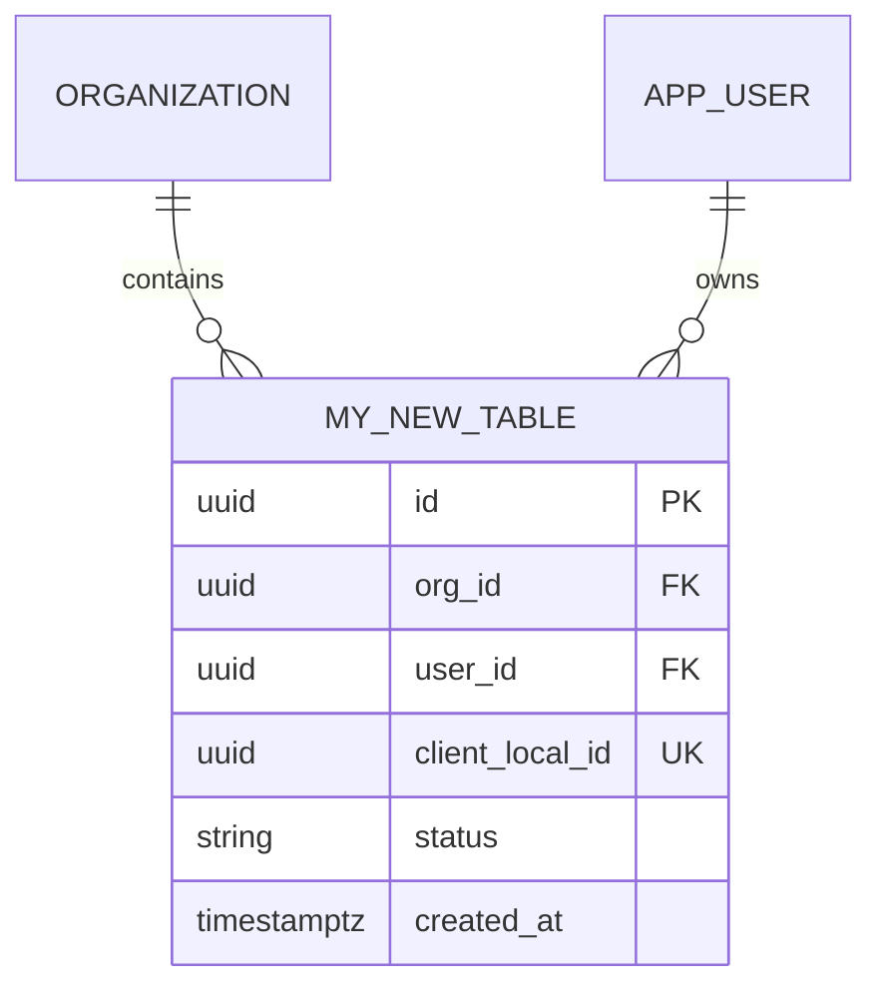

# SDD-XXX: [Nombre de la Funcionalidad]
> **Tipo:** Feature Full-Stack (Backend + Web + Móvil)  
> **Fecha:** AAAA-MM-DD  
> **Autor / Responsable:** [Nombre]  
> **Estado:** `Draft` | `In Review` | `Approved` | `Implemented`

Las secciones 1-9 son obligatorias para cualquier feature. Los anexos (A-E) son opcionales:
sumalos solo si la funcionalidad los necesita — no rellenes uno que no aplica.

---

## 1. Contexto y Objetivos de Producto

### 1.1 Problema del Usuario
- ¿Qué dolor o necesidad resuelve esta funcionalidad?
- ¿A qué roles impacta? (`owner`, `coach`, `client`, o usuarios independientes).

### 1.2 Objetivos y Criterios de Éxito
- [ ] **Objetivo 1:** [Descripción medible]
- [ ] **Objetivo 2:** [Descripción medible]

### 1.3 Fuera de Alcance (Non-goals)
- [Funcionalidades que deliberadamente NO entran en este incremento]

---

## 2. Modelo de Dominio e Invariantes (`api/internal/domain/`)

### 2.1 Entidades y Value Objects
```go
package domain

import (
    "time"
    "github.com/google/uuid"
)

type MyFeatureEntity struct {
    ID        uuid.UUID
    OrgID     *uuid.UUID
    UserID    uuid.UUID
    Status    string
    CreatedAt time.Time
    UpdatedAt time.Time
}
```

### 2.2 Invariantes y Reglas de Negocio
1. **Regla 1:** [Ejemplo: Límites cuantitativos, transiciones válidas de estado].
2. **Regla 2:** [Ejemplo: Aislamiento multi-tenant; sólo el coach asignado o admin puede mutar].

---

## 3. Esquema y Persistencia (`api/db/`)

### 3.1 Migración Goose DDL (`api/db/migrations/XXXX_my_feature.sql`)
```sql
-- +goose Up
CREATE TABLE my_feature (
    id UUID PRIMARY KEY DEFAULT gen_random_uuid(),
    org_id UUID REFERENCES organization(id) ON DELETE CASCADE,
    user_id UUID NOT NULL REFERENCES app_user(id) ON DELETE CASCADE,
    client_local_id UUID,
    status VARCHAR(32) NOT NULL DEFAULT 'active',
    created_at TIMESTAMPTZ NOT NULL DEFAULT now(),
    updated_at TIMESTAMPTZ NOT NULL DEFAULT now(),
    CONSTRAINT my_feature_user_local_uq UNIQUE (user_id, client_local_id)
);

CREATE INDEX idx_my_feature_org_user ON my_feature(org_id, user_id);

-- +goose Down
DROP TABLE IF EXISTS my_feature;
```

### 3.2 Queries SQLC (`api/db/queries/my_feature.sql`)
```sql
-- name: CreateMyFeature :one
INSERT INTO my_feature (org_id, user_id, client_local_id, status)
VALUES ($1, $2, $3, $4)
RETURNING *;

-- name: ListMyFeaturesByOrg :many
SELECT * FROM my_feature
WHERE org_id = $1
ORDER BY created_at DESC;
```

> Migración con varias tablas nuevas o relaciones no triviales → ver **Anexo B**.

---

## 4. Contratos de API REST (`api/internal/transport/http/`)

### 4.1 Endpoints y Rutas
| Método | Ruta | Middleware | Roles Permitidos | Descripción |
|---|---|---|---|---|
| POST | `/v1/my-feature` | `auth`, `RequireOrg`, `RequireRole` | `coach`, `owner` | Crea un nuevo registro |
| GET | `/v1/my-feature` | `auth`, `tenant` | `coach`, `client` | Lista registros con filtro |

### 4.2 DTOs de Request y Response (`internal/transport/http/dto/`)
```go
type CreateMyFeatureRequest struct {
    ClientLocalID *uuid.UUID `json:"client_local_id,omitempty"`
    Status        string     `json:"status"`
}

type MyFeatureResponse struct {
    ID        uuid.UUID  `json:"id"`
    OrgID     *uuid.UUID `json:"org_id,omitempty"`
    UserID    uuid.UUID  `json:"user_id"`
    Status    string     `json:"status"`
    CreatedAt time.Time  `json:"created_at"`
}
```

> Contrato con varios endpoints, tabla de errores o tipos TS/Dart explícitos → ver **Anexo A**.

---

## 5. Diseño Hexagonal (Backend Go)

### 5.1 Puertos de Repositorio (`internal/domain/my_feature.go`)
```go
type MyFeatureRepository interface {
    Create(ctx context.Context, item *MyFeatureEntity) (*MyFeatureEntity, error)
    GetByID(ctx context.Context, id uuid.UUID) (*MyFeatureEntity, error)
    ListByOrg(ctx context.Context, orgID uuid.UUID) ([]*MyFeatureEntity, error)
}
```

### 5.2 Casos de Uso (`internal/service/my_feature.go`)
- `MyFeatureService.Create(ctx, input)`: Valida invariantes, invoca repositorio y registra evento en `AuditLogger`.
- `MyFeatureService.Get(ctx, id)`: Recupera entidad y valida tenencia.

### 5.3 Adaptador Postgres (`internal/adapter/postgres/my_feature.go`)
- Implementación sobre `*db.Queries`.
- Mapeo bidireccional `db.MyFeature` ↔ `domain.MyFeatureEntity`.
- Manejo explícito: `if errors.Is(err, pgx.ErrNoRows) { return nil, domain.ErrNotFound }`.

> Adapter que llama a Claude / IA externa → ver **Anexo D**.

---

## 6. Frontend: Panel Web Coach (`web/`)

- **Rutas / Páginas:** `/my-feature`, `/my-feature/[id]`
- **Cliente API (`src/lib/api.ts`):** Nuevos métodos tipados `getMyFeatures()`, `createMyFeature()`.
- **Componentes:** Tabla / tarjetas con shadcn/ui y tokens de color (`docs/DESIGN.md`).

---

## 7. Móvil: App Flutter (`app/`)

- **Persistencia Local (Drift):** Tabla local `LocalMyFeatures` en `core/storage/`.
- **State Management:** Provider en Riverpod (`my_feature_provider.dart`).
- **Manejo Offline e Idempotencia:** generar `client_local_id` al crear la fila local y dejarla con
  `synced = false` hasta que el servidor la confirme (ver **Anexo C** para el contrato completo).

> Feature con cola de sincronización, resolución de conflictos o micro-interacciones no triviales → ver **Anexo C**.

---

## 8. Seguridad, Multi-Tenancy y Auditoría

- **Validación Multi-Tenant:** `org_id` extraído del token JWT en middleware y verificado en queries.
- **Auditoría:** Registro en `audit_log` con acción `my_feature.create`, `actor_user_id` y `org_id`.

---

## 9. Plan de Verificación y Testing

- [ ] **Tests Unitarios de Dominio:** `go test ./internal/domain/...`
- [ ] **Tests de Servicio (con Fakes):** `go test ./internal/service/...`
- [ ] **Compilación y Linters:**
  - Backend: `cd api && go vet ./... && go build ./...`
  - Web: `cd web && pnpm lint && pnpm build`
  - Móvil: `cd app && flutter analyze && flutter test`

---

## Anexos opcionales

### Anexo A — Contrato de API detallado
Usar cuando la sección 4 se queda corta: varios endpoints, headers/query params,
tabla completa de errores, o tipos explícitos para Web/Flutter.

#### A.1 Headers y parámetros
| Header | Tipo | Requerido | Descripción |
|---|---|---|---|
| `Authorization` | `Bearer <token>` | Sí | JWT Access Token |
| `Content-Type` | `application/json` | Sí | Formato del payload |

| Parámetro | Ubicación | Tipo | Requerido | Descripción |
|---|---|---|---|---|
| `id` | Path | `UUID` | Sí | ID del recurso |
| `date` | Query | `string (YYYY-MM-DD)` | No | Filtro de fecha |

#### A.2 Respuestas de error
| Código HTTP | Error Code | Motivo / Causa |
|---|---|---|
| `400 Bad Request` | `INVALID_PAYLOAD` | JSON malformado o campos inválidos |
| `401 Unauthorized`| `UNAUTHORIZED` | Token ausente o expirado |
| `403 Forbidden`   | `FORBIDDEN` | Rol insuficiente o de otra organización |
| `404 Not Found`   | `NOT_FOUND` | Recurso no existe o pertenece a otro tenant |
| `409 Conflict`    | `DUPLICATE_ENTRY` | Violación de unicidad |

#### A.3 Tipos Web / Móvil
```typescript
// web/src/lib/api.ts (no hay carpeta types/: los tipos viven junto al cliente)
export interface FeatureResponse {
  id: string;
  org_id?: string;
  field_name: string;
  created_at: string;
}
```
```dart
// app/lib/core/network/models.dart
class FeatureModel {
  final String id;
  final String? orgId;
  final String fieldName;
  final DateTime createdAt;

  FeatureModel({required this.id, this.orgId, required this.fieldName, required this.createdAt});
  factory FeatureModel.fromJson(Map<String, dynamic> json) => ...;
}
```

---

### Anexo B — Esquema extendido
Usar para migraciones con varias tablas o relaciones no triviales.



Reglas de integridad:
1. **Multi-tenant:** `org_id` en los índices de búsqueda cuando el dato pertenece a un gimnasio.
2. **Idempotencia:** `client_local_id` + `user_id` en `UNIQUE` para entidades creadas desde móvil.
3. **Nulls:** `COALESCE` en agregaciones para que SQLC genere tipos no-nulos.
4. **FKs:** `ON DELETE CASCADE` / `RESTRICT` explícito según corresponda.

---

### Anexo C — Sync offline y móvil
Usar para features con cola de sincronización, resolución de conflictos o micro-interacciones.

Modelo real hoy (`app/lib/core/storage/`): **no existe una tabla `pending_mutation`**. La cola es
la propia tabla Drift con un flag `synced`, y el contrato del store es
`saveSession` → `unsyncedSessions()` → `markSynced(localId)` (`workout_store.dart:85-89`).
Una feature nueva que necesite cola offline replica ese patrón, salvo que justifique otro.

```
[Usuario registra dato en Móvil]
           │
           ▼
[Guarda en Drift con synced = false]
           │
           ├── ¿Hay red? ─── NO ───> [Queda pendiente en la tabla local]
           │                              │
           YES                            ▼ (al abrir la app o volver a foreground)
           ▼                              │
[POST /v1/sync/... (lote de unsyncedSessions)] <─┘
           │
           ├── 200 OK ────────> [markSynced(localId)]
           └── Error 5xx/Red ─> [Sigue pendiente para el próximo disparo]
```

- **Disparadores de reintento:** arranque de `HomeShell` y `AppLifecycleState.resumed`
  (`home_shell.dart:26,36-38`). **No hay** backoff exponencial ni escucha de conectividad
  (`connectivity_plus` no es dependencia del proyecto). Si una feature los necesita, se especifica
  acá y la dependencia entra como parte del SDD.
- **Estrategia de conflicto:** *Client-Wins* determinista — lo registrado en el teléfono manda.
- **Idempotencia — leer con cuidado:** `client_local_id` da idempotencia **de transporte**
  (reenviar el mismo lote no debe duplicar). No alcanza por sí solo: si la tabla ya tiene una
  **restricción de negocio** más estrecha, el `ON CONFLICT` debe apuntar a *esa* restricción.
  Ver la regla de oro 4 en [SDD_METHODOLOGY.md](../../SDD_METHODOLOGY.md) y el caso `habit_log`
  que la motivó.
- **Distinguir alta de reenvío:** devolver `(xmax = 0) AS inserted` en el `RETURNING` y usar ese
  flag para no volver a otorgar XP, rachas ni logros en un reenvío.
- **Micro-interacciones:** especificar haptics/animaciones solo si son criterio de aceptación.

---

### Anexo D — Flujo de IA supervisada
Usar para features que agregan o cambian un flujo de `internal/adapter/anthropic/`.

- **Filosofía de seguridad:** la IA nunca escribe directo en tablas operativas; siempre genera una
  propuesta `pending` que el coach aprueba o rechaza.
- **Trigger:** `cmd/worker` (pasada única, pensada para cron) u on-demand desde el panel.

Contrato de tool-use vigente (`adapter/anthropic/suggester.go:25-53`). Copiarlo del código y
extenderlo — no reescribirlo de memoria:
```json
{
  "name": "propose_suggestion",
  "input_schema": {
    "type": "object",
    "required": ["kind", "rationale", "confidence", "payload"],
    "properties": {
      "kind": {
        "type": "string",
        "enum": ["volume_adjust", "load_adjust", "exercise_swap", "deload", "rest_day", "habit_nudge"]
      },
      "rationale": { "type": "string", "description": "Una frase en español para que el coach decida rápido" },
      "confidence": { "type": "number", "description": "Entre 0 y 1" },
      "payload": {
        "type": "object",
        "properties": {
          "target_exercise_id":      { "type": "string" },
          "delta_percent":           { "type": "number" },
          "suggested_exercise_name": { "type": "string" },
          "note":                    { "type": "string" }
        }
      }
    }
  }
}
```

Validación en `domain.Suggestion.Validate()` — lo que el código exige hoy, ni más ni menos:
1. `kind` dentro del enum de arriba.
2. `rationale` no vacío (**sin** tope de longitud).
3. `confidence` dentro de `[0,1]`. **No hay umbral mínimo**: una sugerencia de confianza baja se
   persiste igual y la descarta el coach.
4. `load_adjust` con `|delta_percent| > MaxLoadDeltaPercent` (10%) → rechazada.
5. `volume_adjust` con `|delta_percent| > MaxVolumeDeltaPercent` (30%) → rechazada.

Endurecer esto (por ejemplo, agregar un piso de confianza) es un cambio de código con su test, no
una línea de documento.

**Qué se aplica al aprobar:** solo `AppliableKinds` (`load_adjust`, `volume_adjust`) muta el plan;
el resto se registra como revisado sin tocar `assigned_exercise`. `load_adjust` escala
`target_weight_kg` (redondeo a 2.5 kg); `volume_adjust` escala `target_reps_min/max` — **volumen
son repeticiones, no series**. La mutación marca `override_source = 'ai_suggestion'`, que el motor
de progresión consume una sola vez.

Flujo: `POST /v1/ai-suggestions/{id}/approve|reject` → si aprueba, muta dentro de la misma
transacción y registra `audit_log`; los dos botones con igual peso visual.

---

### Anexo E — Bugfix / RCA
Usar cuando este documento describe un fix en vez de una feature nueva. Cambiá el prefijo del
título a `FIX-XXX` y el estado a `Investigating` | `Identified` | `Fix Proposed` | `Resolved`.

1. **Síntomas:** comportamiento observado vs. esperado, impacto (usuarios, datos, requests).
2. **Causa raíz:** capa de origen (`domain`/`service`/`adapter`/`transport`/`web`/`app`), mecanismo
   del fallo, por qué no lo atrapó la suite existente.
3. **Test de no-regresión primero:**
   ```go
   func TestBugRegression_XXX(t *testing.T) {
       // Escenario que dispara el fallo; debe fallar con el código previo al fix
   }
   ```
4. **Fix por capas:** qué cambia en dominio, adapter/persistencia, transporte/frontend.
5. **Reparación de datos** (si hubo corrupción): script idempotente de saneamiento en SQL.
6. **Verificación:** test de regresión en verde + suite completa + `impact` de GitNexus para
   descartar efectos colaterales.
